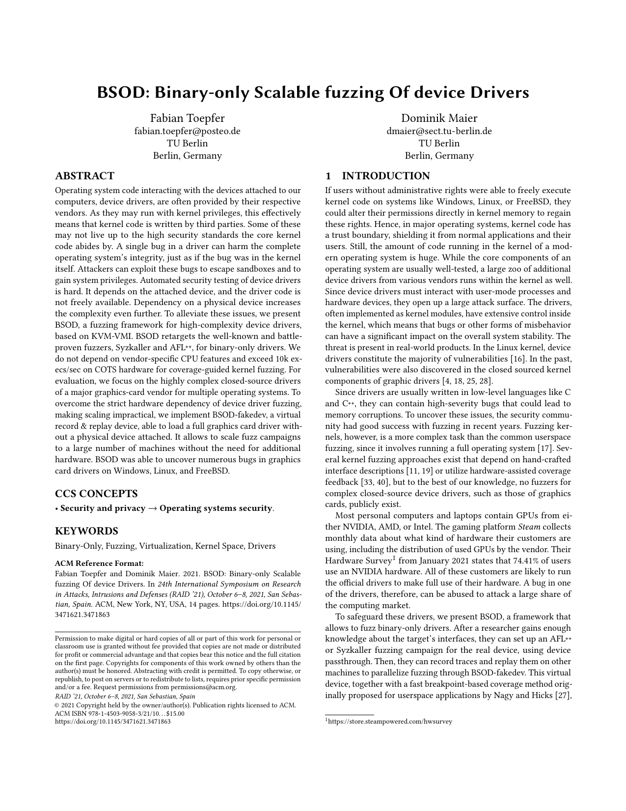

# bsod-kernel-fuzzing

This repository contains the implementations described in "BSOD: Binary-only Scalable fuzzing Of device Drivers".

The paper and the project are based on my master's thesis with the title "Closed-Source Kernel Driver Fuzzing Through Device Emulation in QEMU", which I wrote at the Chair for Security in Telecommunications (SecT) at the TU Berlin.

During the experiments, we found and reported three [vulnerabilities in the NVIDIA graphic drivers](https://nvidia.custhelp.com/app/answers/detail/a_id/5211) identified by [CVE-2021-1090](https://nvd.nist.gov/vuln/detail/CVE-2021-1090), [CVE-2021-1095](https://nvd.nist.gov/vuln/detail/CVE-2021-1095), and [CVE-2021-1096](https://nvd.nist.gov/vuln/detail/CVE-2021-1096).

## Requirements

- [kvm-vmi](kvm-vmi)

    The fuzzing setups rely on the [KVM-VMI](https://github.com/KVM-VMI/kvm-vmi) project that provides introspection capabilities for KVM.
    It consists of a modified KVM kernel module and QEMU, libkvmi and libvmi.
    To prepare the host, follow the [Setup instructions](https://kvm-vmi.github.io/kvm-vmi/master/setup.html).

- A guest file system image for fuzzing.

    For Linux, you should consider creating a [minimal rootfs](scripts/rootfs).

## [bsod-afl](bsod-afl)

Kernel fuzzing with AFL initially based on [kernel-fuzzer-for-xen-project](https://github.com/intel/kernel-fuzzer-for-xen-project).

## [bsod-syzkaller](bsod-syzkaller)

Modified syzkaller kernel fuzzer with patches for using syz-bp-cov, a small tool that provides coverage feedback via breakpoints intended for fuzzing closed-source targets.

## [bsod-fakedev](bsod-fakedev)

QEMU with pci-replay device and implementation based on a nvidia reference device and scripts to extract pci-replay data out of QEMU's vfio trace data.